# Dataset Introduction

The point cloud reconstruction scene contains 10 high-fidelity point cloud digital
models, with approximately 10 million point cloud data for each scene.
1.	Wei Song*, Dechao Li, Su Sun, Xinghui Xu and Guidong Zu*, Registration for 3-D LiDAR Datasets using Pyramid Reference Object, IEEE Transactions on Instrumentation and Measurement, doi: 10.1109/TIM.2023.3300410, 2023.08.

## 3D Reconstruction Results

<figure class="half">
    

    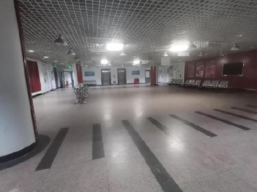
        &nbsp&nbsp&nbsp&nbsp&nbsp&nbsp&nbsp&nbsp&nbsp
    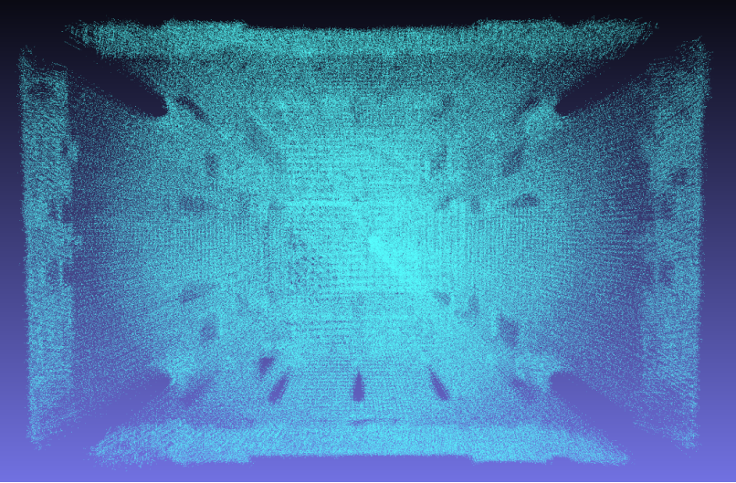
    

    
<b>&nbsp&nbsp&emsp;&emsp;&emsp;&emsp;&emsp;&emsp;&emsp;&emsp;&emsp;&emsp;&emsp;&emsp;&emsp;&emsp;&emsp;&emsp;&emsp;&emsp;Scene 1</b>

</figure>
<figure class="half">
    

    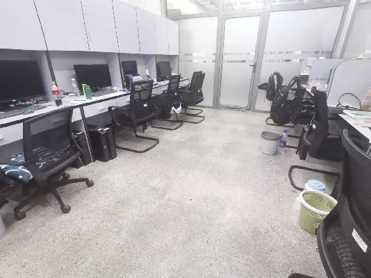
        &nbsp&nbsp&nbsp&nbsp&nbsp&nbsp&nbsp&nbsp&nbsp
    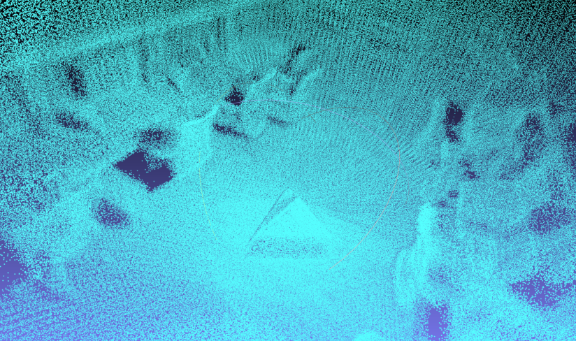
    

    
<b>&nbsp&nbsp&emsp;&emsp;&emsp;&emsp;&emsp;&emsp;&emsp;&emsp;&emsp;&emsp;&emsp;&emsp;&emsp;&emsp;&emsp;&emsp;&emsp;&emsp;Scene 2</b>

</figure>

<figure class="half">
    

    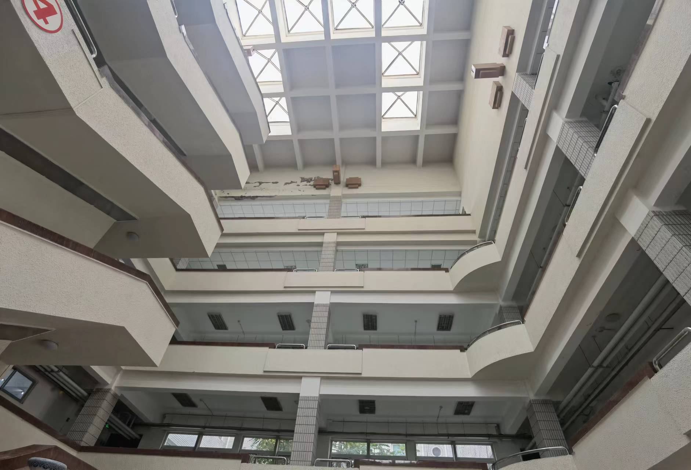
        &nbsp&nbsp&nbsp&nbsp&nbsp&nbsp&nbsp&nbsp&nbsp
    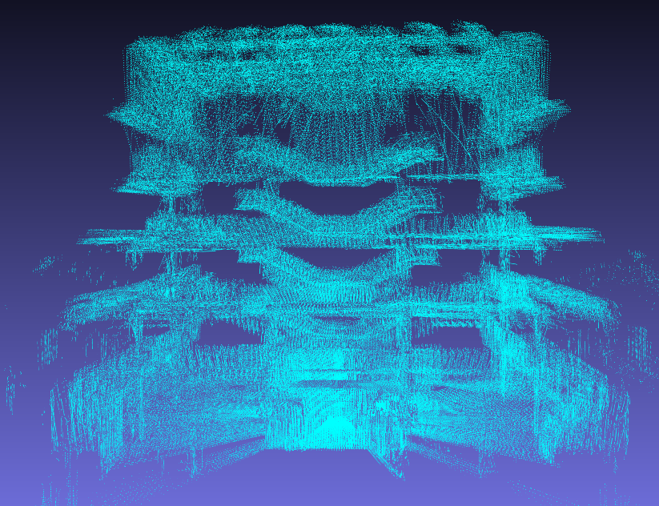
    

    
<b>&nbsp&nbsp&emsp;&emsp;&emsp;&emsp;&emsp;&emsp;&emsp;&emsp;&emsp;&emsp;&emsp;&emsp;&emsp;&emsp;&emsp;&emsp;&emsp;&emsp;Scene 3</b>

</figure>

<figure class="half">
    

    
        &nbsp&nbsp&nbsp&nbsp&nbsp&nbsp&nbsp&nbsp&nbsp
    
    

    
<b>&nbsp&nbsp&emsp;&emsp;&emsp;&emsp;&emsp;&emsp;&emsp;&emsp;&emsp;&emsp;&emsp;&emsp;&emsp;&emsp;&emsp;&emsp;&emsp;&emsp;Scene 4</b>

</figure>

<figure class="half">
    

    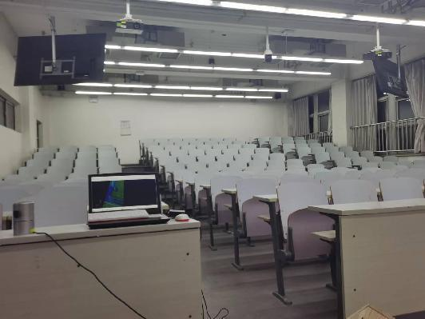
        &nbsp&nbsp&nbsp&nbsp&nbsp&nbsp&nbsp&nbsp&nbsp
    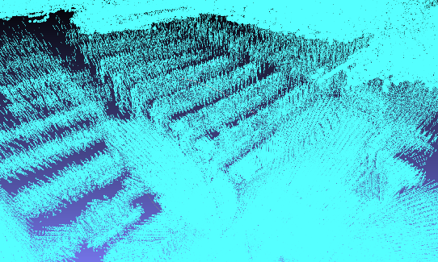
    

    
<b>&nbsp&nbsp&emsp;&emsp;&emsp;&emsp;&emsp;&emsp;&emsp;&emsp;&emsp;&emsp;&emsp;&emsp;&emsp;&emsp;&emsp;&emsp;&emsp;&emsp;Scene 5</b>

</figure>

<figure class="half">
    

    
        &nbsp&nbsp&nbsp&nbsp&nbsp&nbsp&nbsp&nbsp&nbsp
    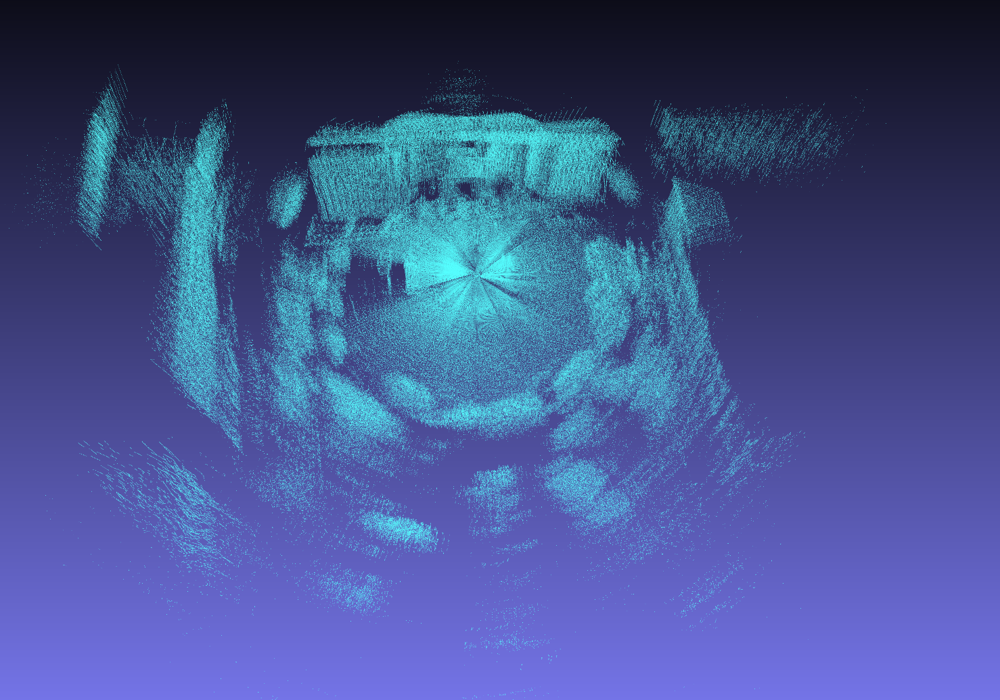
    

    
<b>&nbsp&nbsp&emsp;&emsp;&emsp;&emsp;&emsp;&emsp;&emsp;&emsp;&emsp;&emsp;&emsp;&emsp;&emsp;&emsp;&emsp;&emsp;&emsp;&emsp;Scene 6</b>

</figure>

<figure class="half">
    

    
        &nbsp&nbsp&nbsp&nbsp&nbsp&nbsp&nbsp&nbsp&nbsp
    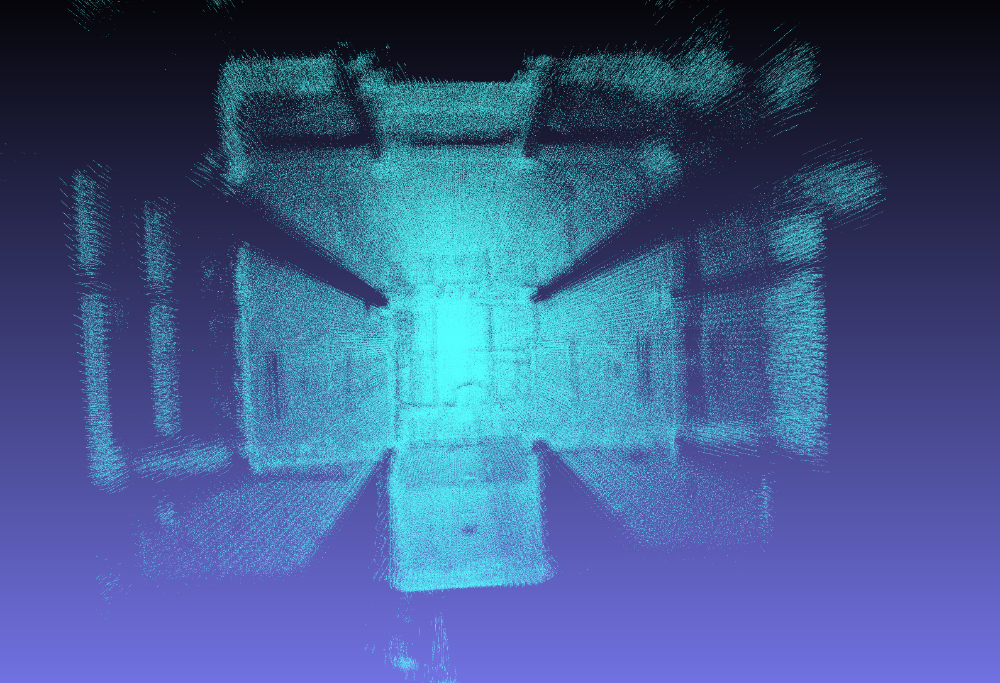
    

    
<b>&nbsp&nbsp&emsp;&emsp;&emsp;&emsp;&emsp;&emsp;&emsp;&emsp;&emsp;&emsp;&emsp;&emsp;&emsp;&emsp;&emsp;&emsp;&emsp;&emsp;Scene 7</b>

</figure>

<figure class="half">
    

    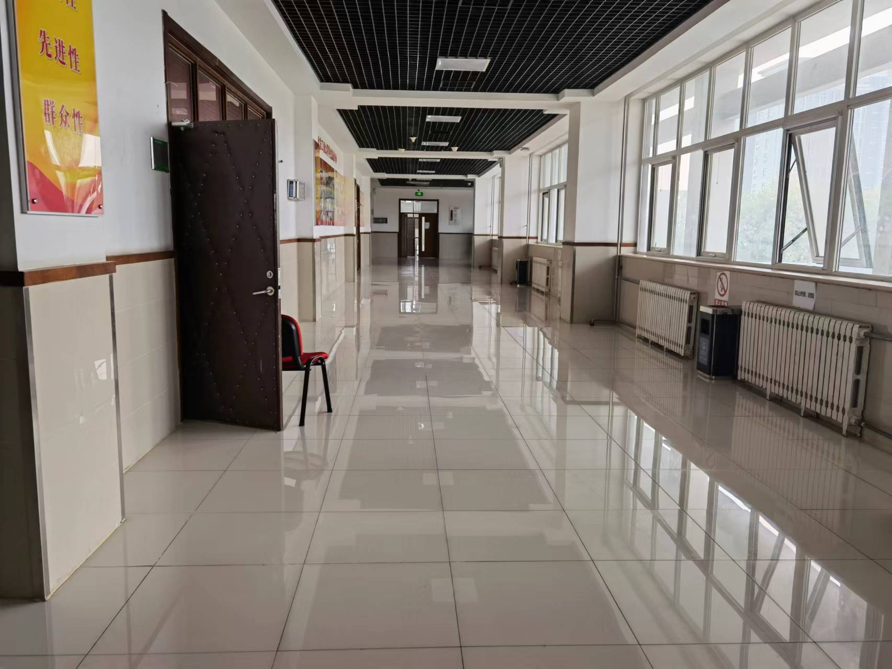
        &nbsp&nbsp&nbsp&nbsp&nbsp&nbsp&nbsp&nbsp&nbsp
    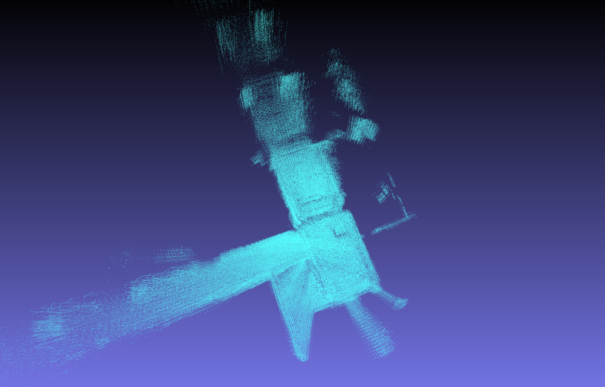
    

    
<b>&nbsp&nbsp&emsp;&emsp;&emsp;&emsp;&emsp;&emsp;&emsp;&emsp;&emsp;&emsp;&emsp;&emsp;&emsp;&emsp;&emsp;&emsp;&emsp;&emsp;Scene 8</b>

</figure>

<figure class="half">
    

    
        &nbsp&nbsp&nbsp&nbsp&nbsp&nbsp&nbsp&nbsp&nbsp
    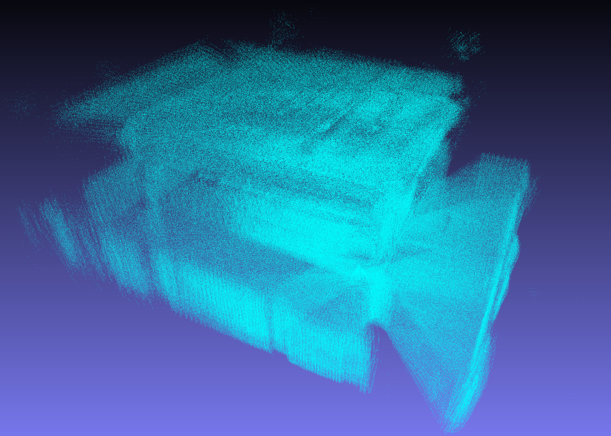
    

    
<b>&nbsp&nbsp&emsp;&emsp;&emsp;&emsp;&emsp;&emsp;&emsp;&emsp;&emsp;&emsp;&emsp;&emsp;&emsp;&emsp;&emsp;&emsp;&emsp;&emsp;Scene 9</b>

</figure>

<figure class="half">
    

    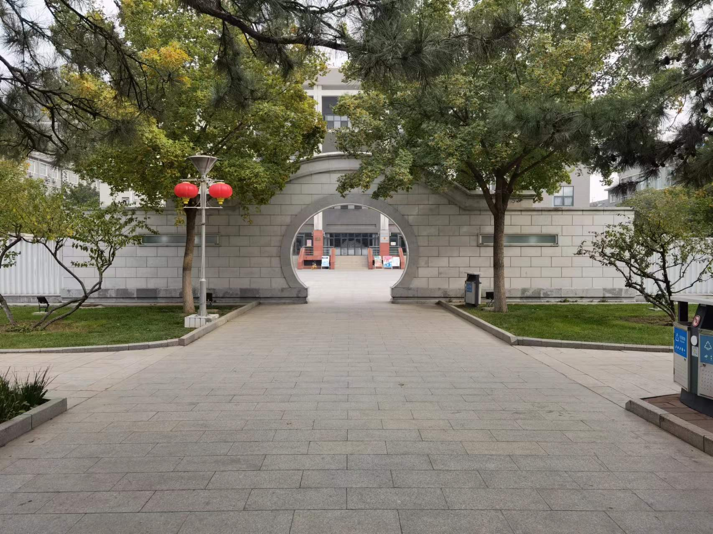
        &nbsp&nbsp&nbsp&nbsp&nbsp&nbsp&nbsp&nbsp&nbsp
    
    

    
<b>&nbsp&nbsp&emsp;&emsp;&emsp;&emsp;&emsp;&emsp;&emsp;&emsp;&emsp;&emsp;&emsp;&emsp;&emsp;&emsp;&emsp;&emsp;&emsp;&emsp;Scene 10</b>

</figure>

